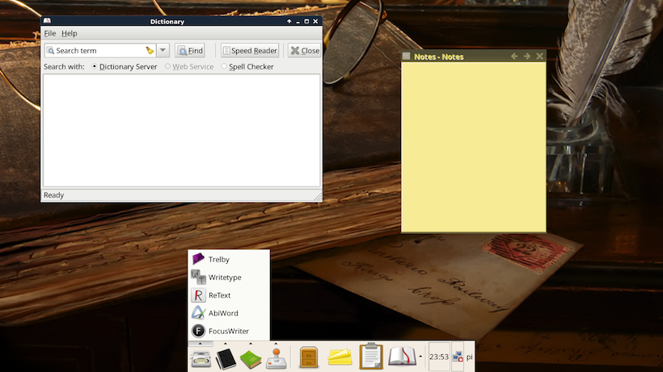

# PiWrite

**Raspberry Pi Writing Suite**

## Overview

PiWrite is a writing suite for the Raspberry Pi. It differs from the standard Raspbian Linux in the following ways:

* It offers 26 extra writing related applications, as well as additional themes, wallpapers, and other customizations.

* It comes with a Writer's Directory within the web browser which includes 13 offline web writing apps and tools.

* It uses a specialized configuration of the XFCE desktop environment, which offers a simpler and quicker user interface.

## Installing

The [SDCard Image](https://github.com/nate2squared/piwrite/releases) is available in Releases and it can run on every model of Raspberry Pi.

* Windows - Use [Win 32 Disk Imager](http://sourceforge.net/projects/win32diskimager/)
* MacOS - Use [Apple Pi Baker](http://www.tweaking4all.com/software/macosx-software/macosx-apple-pi-baker/)
* Linux - Follow the instructions at [RaspberryPi.org](https://www.raspberrypi.org/documentation/installation/installing-images/linux.md)

See the [Build.md](Build.md) file for instructions on how to create PiWrite.
