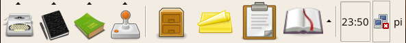
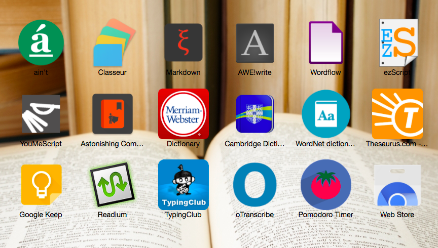
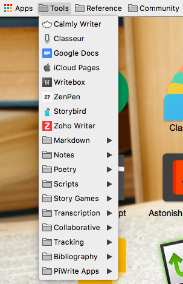
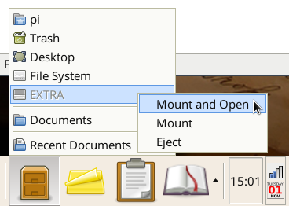
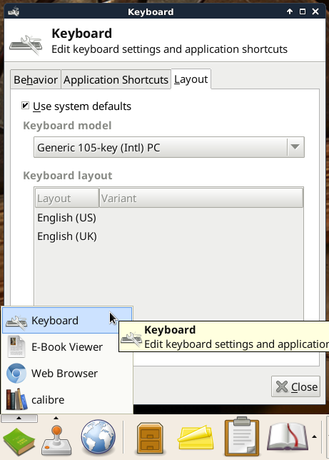

# PiWrite

For full documentation visit [piwrite.com](http://piwrite.com/overview/support/).

## Overview

PiWrite is a writing suite for the Raspberry Pi. It differs from the standard Raspbian Linux in the following ways:

* It offers 26 extra writing related applications, as well as additional themes, wallpapers, and other customizations.

* It uses a specialized configuration of the XFCE desktop environment, which offers a simpler and quicker user interface.

## The Launch Panel

This is the Launch Panel:

Use this to access writing, planning and reference applications.

If you click on one of the launch icon's up-pointing arrows it will show the list of applications available under that category.

## Applications

These are some of the available applications and their purpose:

* **AbiWord** - Word processor *(similar to Microsoft Word or LibreOffice Writer)*
* **Calibre** - eBook reading and editing
* **CherryTree** - Note taking *(similar to Evernote)*
* **Focus Writer** - Distraction free writing *(similar to Write!, OmmWriter, WriteMonkey, etc.)*
* **Kabikaboo & Plume Creator** - Plotting and writing *(similar to Scriviner, iAWriter, Storyist, etc.)*
* **Red Notebook** - Journal *(Similar to Day One, Journey, MacJournal, etc.)*
* **Trelby** - Scripts and Screenplays *(similar to First Draft, Fade In, Scripware etc.)*
* **WriteType** - Essay writing software for students

## Web Guide

Along with these applications there are web browser based applications:

& There is a directory of writing links ...

## System Tasks

Here are some of the system tasks you may want to carry out:

### Internet Configuration

You can configure Internet access using the network preferences:

### Utilities

You can add sticky notes to the desktop

You can view a history of text you have copied and pasted

& You can look up words in the dictionary

### Shutdown & Restart

You can shutdown your Raspberry Pi, or Restart from Log Out menu.

### Transfer Documents

You can transfer your documents to a USB drive

### Keyboard Configuration

You can change the keyboard language

## Donations

Consider helping support this project -

[Donate](http://piwrite.com/overview/donations/)

## Links

Additional online documentation is available at -

[XFCE Documentation](http://docs.xfce.org/xfce/getting-started)

[Raspberry Pi Documentation](https://www.raspberrypi.org/documentation/)

The source code for PiWrite is on [Github](https://github.com/nate2squared/piwrite) 